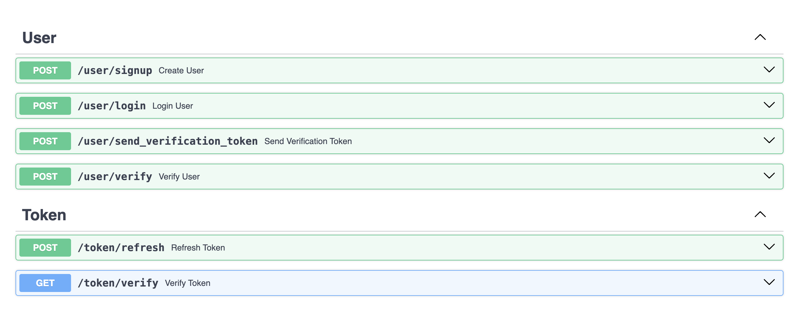
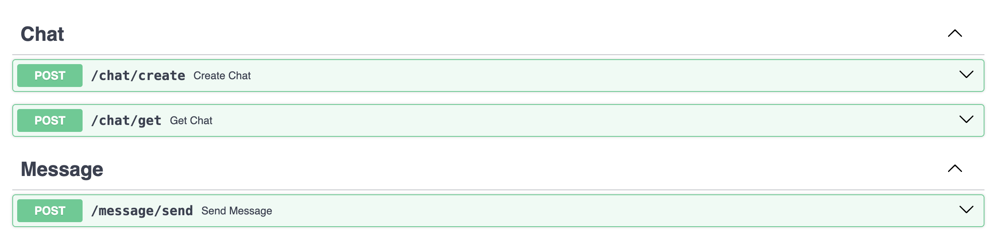

# Messenger API with Microservice Architecture

- ACCESS SERVICE
- MESSAGE SERVICE
- NOTIFICATION SERVICE

### Особенности:
- Проект основан на чистой архитектуре
- Код придерживается принципам SOLID
- Реализовал некоторые паттерны из DDD и EDA
- Аутентификация на основе JWT 
- Система верификации пользователя с помощью SMS 
- Система коммуникаций пользователей с помощью вебсокетов
- Система миграций
- Нереляционная БД для чатов. Реляционная БД для пользователей
- Брокер сообщений между сервисом доступа и уведомлений
- Каждый сервис завернут в Docker и является самостоятельной единицей

### Access Service Endpoints

### Message Service Endpoints

Также *Chat Get* и *Message Send* поддерживают SocketIO подключение

### Стэк технологий:
FastAPI, PostgreSQL, Docker, Kafka, Redis, MongoDB, SocketIO, SQLAlchemy, Pydantic, Alembic, SmsAero

### Лицензия GPLv3

